# Astro blog on GitHub Pages

Scaffold a new Astro-based blog with Markdown content collections, client-side search (Pagefind), utterances comments (GitHub Issues), tag pages, RSS/SEO, and a GitHub Actions workflow that builds and deploys automatically to GitHub Pages at https://nga-tran.github.io/.

## Why Astro + these pieces

GitHub Pages only serves static files — there's no server to run. "Dynamic" behavior on a static host comes from:

- Build-time generation (Astro renders Markdown posts, tag pages, RSS at build time)
- Client-side JS for interactivity after the page loads (search, comments)

Chosen approach:

- **Framework**: Astro 7 (content collections, fast builds, minimal client-side JS by default; pinned to a current patched release)
- **Search**: [Pagefind](https://pagefind.app/) — indexes the built site at build time, ships a small client-side search UI, zero server required. Standard pairing with Astro static blogs.
- **Comments**: [utterances](https://utteranc.es/) — a client-side embed backed by GitHub Issues on this repo. Fits naturally since you're already on GitHub.
- **Content format**: every blog entry is a single plain Markdown (`.md`) file with YAML frontmatter — no MDX, no database, no CMS. Writing a new post = adding one `.md` file to `content/blog/` at the repo root (kept out of `src/`, which holds only source code). This uses Astro's Content Layer API `glob()` loader, which supports pointing a collection at any directory, not just `src/content/`.
- **Deploy target**: user page repo `NGA-TRAN/nga-tran.github.io`, served at `https://nga-tran.github.io/` — so `astro.config.mjs` sets `site: "https://nga-tran.github.io"` and `base: "/"` (overridable in CI via `SITE`/`BASE`). All internal links use Astro's base-aware helpers (`import.meta.env.BASE_URL`).

## Site structure

```mermaid
flowchart LR
    subgraph content [Content - repo root]
        posts["content/blog/*.md"]
    end
    subgraph srcConfig [src - source code]
        config["src/content.config.ts (loader + schema)"]
    end
    subgraph pages [Pages]
        index["src/pages/index.astro"]
        post["src/pages/blog/[...slug].astro"]
        tags["src/pages/tags/[tag].astro"]
        about["src/pages/about.astro"]
        search["src/pages/search.astro"]
        rss["src/pages/rss.xml.js"]
    end
    subgraph build [Build]
        astroBuild["astro build -> dist/"]
        pagefindIndex["pagefind --site dist"]
    end
    subgraph deploy [GitHub Actions]
        workflow[".github/workflows/deploy.yml"]
        ghPages["GitHub Pages"]
    end
    posts --> config --> pages
    pages --> astroBuild --> pagefindIndex --> workflow --> ghPages
```

## Files to create

- `package.json`, `tsconfig.json`, `astro.config.mjs`
  - Integrations: `@astrojs/sitemap` (no MDX integration — plain Markdown only)
  - `site: "https://nga-tran.github.io"`, `base: "/"`
  - `postbuild` npm script: `pagefind --site dist` (pagefind's own asset URLs are base-aware when `base` is set)
- `src/content.config.ts` — defines the `blog` collection using Astro's `glob()` content loader pointed at `../content/blog` (repo-root `content/` directory, outside `src/`), plus a Zod frontmatter schema: `title`, `description`, `pubDate`, `updatedDate?`, `tags: string[]`, `heroImage?`, `draft?`
- `content/blog/` — repo-root directory (sibling of `src/`, not inside it); each post is exactly one `.md` file named `YYYY-MM-DD-slug.md` (or `YYYY-MM-DD-HH-mm-slug.md`) with YAML frontmatter matching the schema above, followed by the post body in Markdown; the date prefix is stripped from the public URL slug; 3 sample posts included covering different tags to demonstrate the layout, code blocks, and images
- `src/layouts/BaseLayout.astro` — shared HTML shell: head/meta/OG tags, header, footer, includes Pagefind UI assets
- `src/layouts/PostLayout.astro` — post title/date/tags header, prose content slot, utterances comments section at the bottom
- `src/components/Header.astro`, `src/components/Footer.astro`, `src/components/PostCard.astro`, `src/components/TagList.astro`, `src/components/Comments.astro` (utterances `<script>` embed backed by GitHub Issues)
  - All internal `<a href>`s built with `import.meta.env.BASE_URL` (e.g. `${import.meta.env.BASE_URL}tags/${tag}`) so links resolve correctly at the site root
- `src/pages/index.astro` — home page listing posts newest-first (`getCollection('blog')`, filter `draft`, sort by `pubDate`)
- `src/pages/blog/[...slug].astro` — individual post page using `getStaticPaths` + `render()`
- `src/pages/tags/index.astro` — all tags overview
- `src/pages/tags/[tag].astro` — posts filtered by tag
- `src/pages/about.astro` — simple about page (placeholder bio)
- `src/pages/search.astro` — mounts the Pagefind UI (`@pagefind/default-ui`) client-side
- `src/pages/rss.xml.js` — `@astrojs/rss` feed generator
- `src/styles/global.css` — clean, modern, readable typography-focused styling (no framework, plain CSS with custom properties)
- `public/favicon.svg`, `public/robots.txt`
- `.github/workflows/deploy.yml` — on push to `main`: build, run pagefind postbuild, then `actions/upload-pages-artifact` + `actions/deploy-pages`. The workflow also keeps a `comments` GitHub Issues label for utterances.
- `.gitignore` — `node_modules`, `dist`, `.astro`
- `README.md` — setup steps: how to run locally (`npm install && npm run dev` — runs at http://localhost:4321/), how to write a post (add a `.md` file to `content/blog/`, not `src/`), and the remaining one-time step:

  1. Install the utterances GitHub App on `NGA-TRAN/nga-tran.github.io` so post comments can create and update GitHub Issues

## Notes / things you'll need to do post-scaffold (can't be scripted)

- utterances requires authorizing the utterances GitHub App on this repo. Issues are already enabled; the deploy workflow keeps a `comments` label for those threads.

## Out of scope

Dark mode and analytics were not selected, so they're omitted. Tags/categories and RSS/SEO are included as standard low-cost baseline good practice for a blog alongside search and comments.
